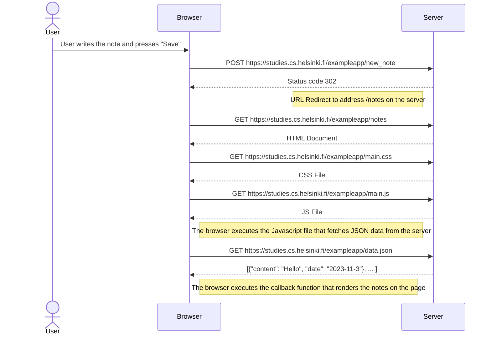

# New note diagram

```mermaid
    sequenceDiagram

    actor U as User
    participant B as Browser
    participant S as Server

    U->>B: User writes the note and presses "Save"

    B->>S: POST https://studies.cs.helsinki.fi/exampleapp/new_note

    S-->>B: Status code 302
    Note left of S: URL Redirect to address /notes on the server

    B->>S: GET https://studies.cs.helsinki.fi/exampleapp/notes
    S-->>B: HTML Document

    B->>S: GET https://studies.cs.helsinki.fi/exampleapp/main.css
    S-->>B: CSS File

    B->>S: GET https://studies.cs.helsinki.fi/exampleapp/main.js
    S-->>B: JS File
    Note right of B: The browser executes the Javascript file that fetches JSON data from the server

    B->>S: GET https://studies.cs.helsinki.fi/exampleapp/data.json
    S-->>B: [{"content": "Hello", "date": "2023-11-3"}, ... ]
    Note right of B: The browser executes the callback function that renders the notes on the page

```