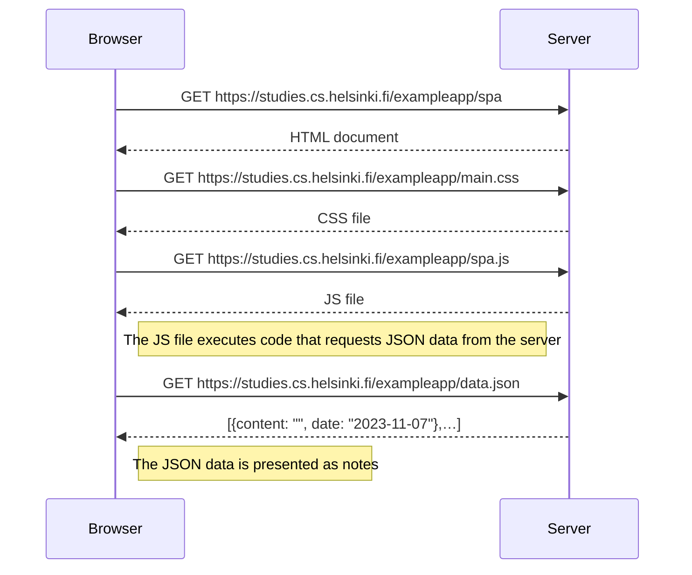

# Single page app diagram

```mermaid
    sequenceDiagram

    participant B as Browser
    participant S as Server

    B->>S: GET https://studies.cs.helsinki.fi/exampleapp/spa
    S-->>B: HTML document

    B->>S: GET https://studies.cs.helsinki.fi/exampleapp/main.css
    S-->>B: CSS file

    B->>S: GET https://studies.cs.helsinki.fi/exampleapp/spa.js
    S-->>B: JS file
    Note right of B: The JS file executes code that requests JSON data from the server

    B->>S: GET https://studies.cs.helsinki.fi/exampleapp/data.json
    S-->>B: [{content: "", date: "2023-11-07"},…]
    Note right of B: The JSON data is presented as notes


```
